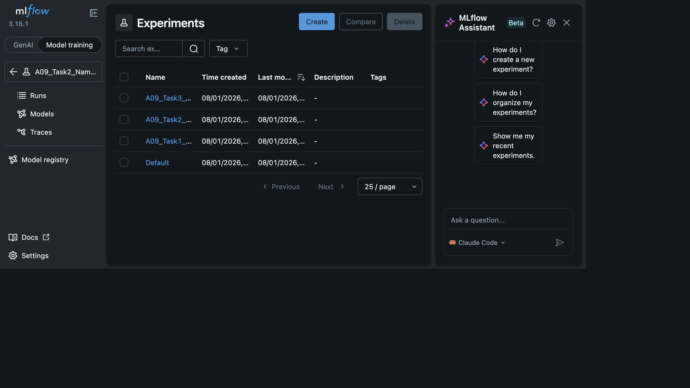
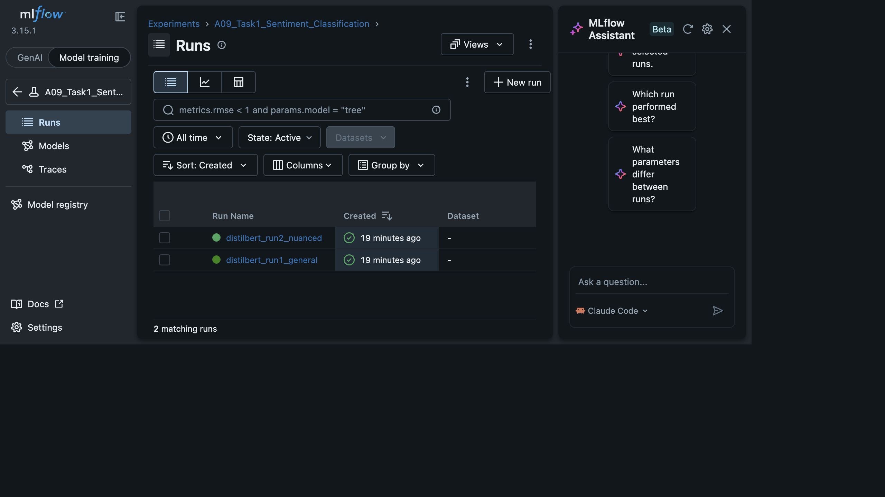
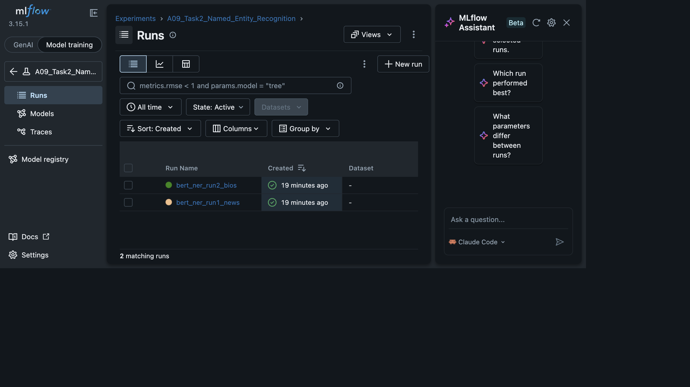

# A09 — Transformers + MLflow Assignment

This project applies three pretrained Hugging Face `transformers` pipelines to downstream NLP tasks, with each run tracked and logged using **MLflow**.

## Tasks

| Task | Model | Pipeline |
|------|-------|----------|
| 1. Sentiment Classification | `distilbert-base-uncased-finetuned-sst-2-english` | `sentiment-analysis` |
| 2. Named Entity Recognition | `dslim/bert-base-NER` | `token-classification` |
| 3. Text Generation | `gpt2` | `text-generation` |

Each task was run **twice** with different configurations/inputs (e.g. general vs. nuanced text, news vs. bios text, low vs. high temperature) and all parameters, metrics, and artifacts were logged to MLflow.

## Project Structure

```
a09_transformers_mlflow.ipynb   # Main notebook (setup, 3 tasks, observations, summary)
mlflow.db                       # MLflow SQLite tracking store
mlruns/                         # MLflow run artifacts (predictions, generations, observations)
screenshots/                    # MLflow UI screenshots (see below)
```

## Viewing MLflow Results Locally

```bash
python3 -m mlflow ui --backend-store-uri sqlite:///mlflow.db --port 5001
```

Then open `http://127.0.0.1:5001` and switch to the **"Model training"** tab to see the Runs tables (the "GenAI" tab shows tracing/observability views, not the classic runs list).

## MLflow UI Screenshots

**Experiments overview** — all 3 task experiments tracked in MLflow:



**Task 1 — Sentiment Classification** (2 runs: `distilbert_run1_general`, `distilbert_run2_nuanced`):



**Task 2 — Named Entity Recognition** (2 runs: `bert_ner_run1_news`, `bert_ner_run2_bios`):



**Task 3 — Text Generation** (2 runs: `gpt2_run1_low_temp`, `gpt2_run2_high_temp`):


